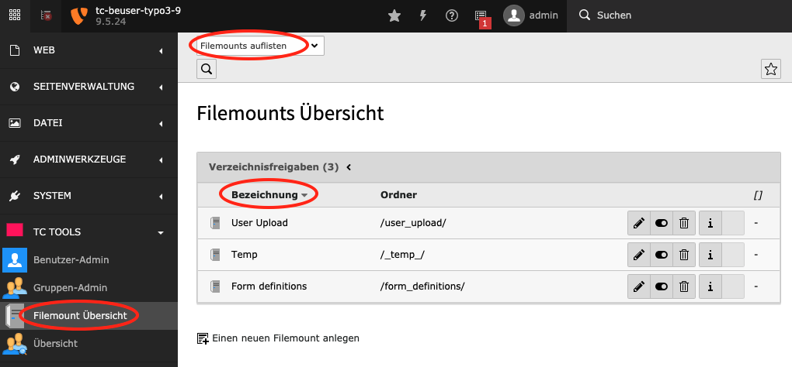
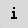
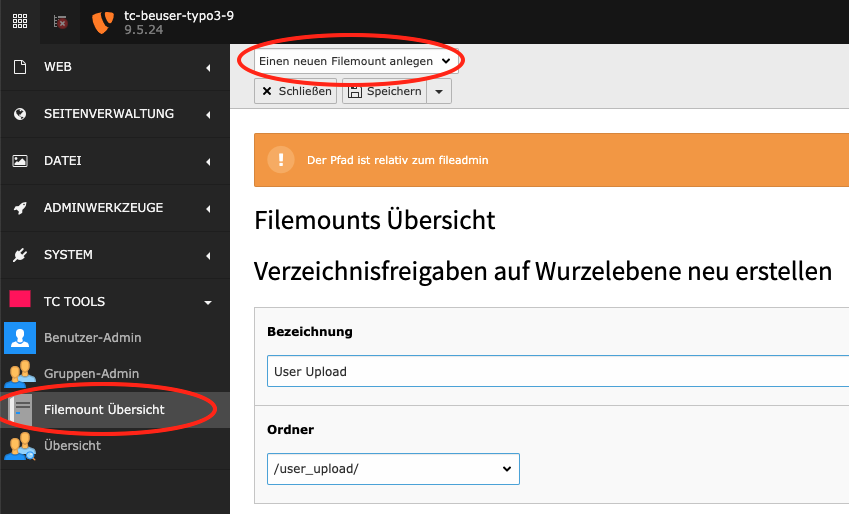

.. ==================================================
.. FOR YOUR INFORMATION
.. --------------------------------------------------
.. -*- coding: utf-8 -*- with BOM.

.. include:: ../Includes.txt

.. _filemounts-view:

Modul: Filemount (Filemounts View)
==================================

Alphabetische Auflistung der Filemounts
---------------------------------------

Mit einem Klick auf die Spaltenüberschrift „LABEL“ erhalten Sie eine aufsteigend sortierte Liste der Filemounts. Mit
einem zweiten Klick auf die Spaltenüberschrift „LABEL“ erhalten Sie eine absteigend sortierte Liste der Filemounts.

Funktionen zum editieren von Datensätzen
----------------------------------------

In der Filemount Liste haben Sie folgende Funktionen:

Informationen anzeigen

.. rst-class::  clear-both

Datensatz verstecken

.. rst-class::  clear-both

löschen

.. rst-class::  clear-both

Neuen Filemount anlegen
-----------------------

Wählen Sie oben rechts in der Auswahlbox „Einen neuen Filemount anlegen“. Es wird ein Formular angezeigt mit dem Sie
einen neuen Filemount anlegen können.

Sortierung nach Kriterien
-------------------------

Die Filemount Liste kann nach verschiedenen Kriterien sortiert werden. Die Backend Filemount Liste nach der aktuellen
Spaltenüberschrift sortiert, die Sortierung ist durch eine Markierung erkenntlich. Durch anklicken einer
Spaltenüberschrift können sie die Sortierung verändern.
