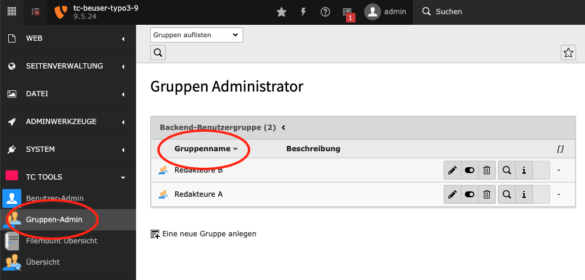
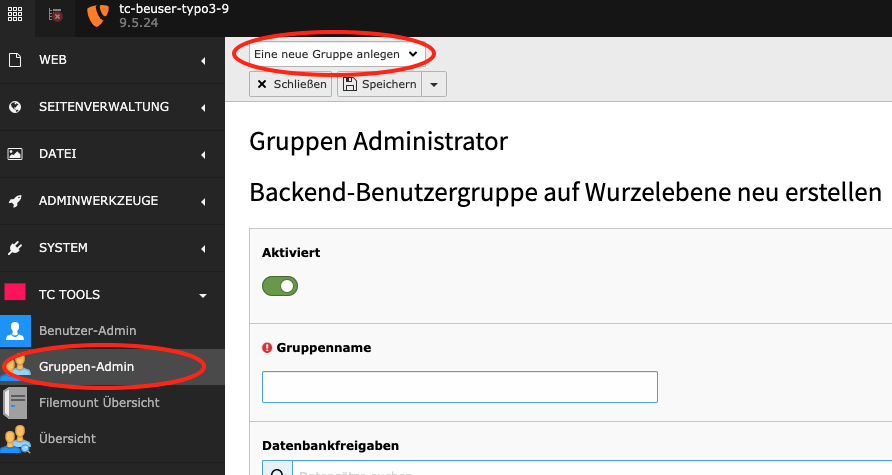
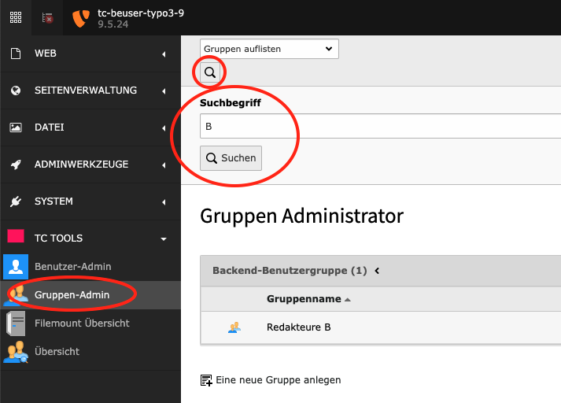

.. ==================================================
.. FOR YOUR INFORMATION
.. --------------------------------------------------
.. -*- coding: utf-8 -*- with BOM.

.. include:: ../Includes.txt

.. _group-admin:

Modul: Gruppen-Admin (Group Admin)
==================================

Alphabetische Auflistung der Backend Benutzergruppen
----------------------------------------------------

Mit einem Klick auf die Spaltenüberschrift "Gruppenname" erhalten Sie eine aufsteigend sortierte Liste der Backend
Benutzergruppen. Mit einem zweiten Klick auf die Spaltenüberschrift erhalten Sie eine absteigend sortierte
Liste der Backend Benutzergruppen.

Neue Benutzergruppe anlegen
---------------------------

Wählen Sie oben in der Auswahlbox "Eine neue Gruppe anlegen". Es wird ein Formular angezeigt, mit dem Sie eine neue
Benutzergruppe an legen können.

Suche nach Backend Benutzergruppen
----------------------------------

Klicken Sie oben auf das Lupe-Icon. Es ermöglicht die Suche nach Benutzergruppen durch Eingabe eines Suchworts
(z.B. Namen).

