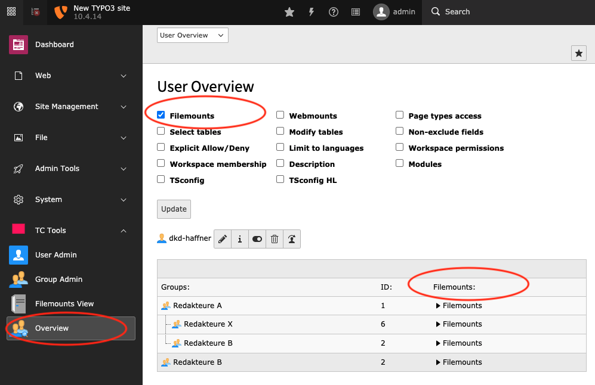
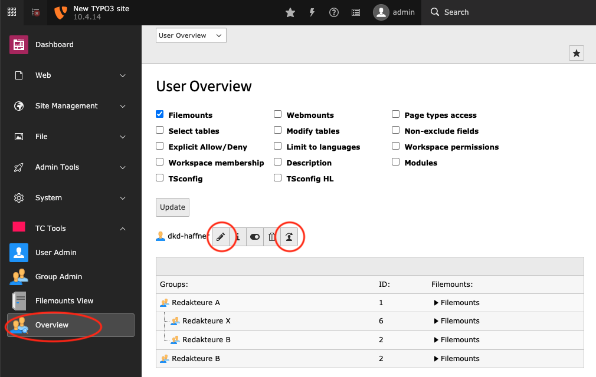
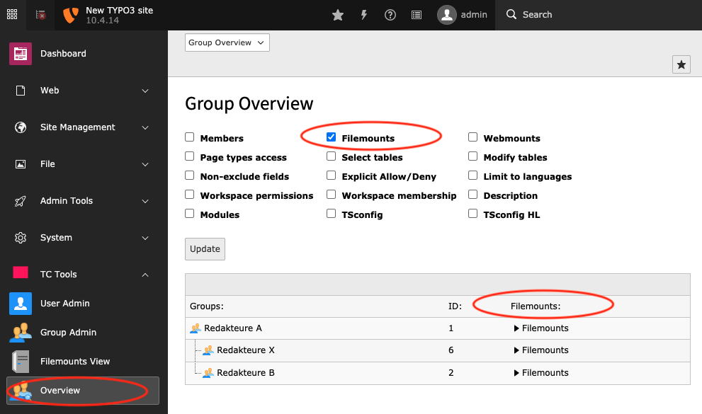

.. ==================================================
.. FOR YOUR INFORMATION
.. --------------------------------------------------
.. -*- coding: utf-8 -*- with BOM.

.. include:: ../Includes.txt

.. _overview:

Modul: Übersicht (Overview)
===========================

Benutzer Übersicht
------------------

Klicken Sie bei einem Benutzer auf die Lupe. Sie können nun über die Auswahlboxen bestimmen welche Informationsspalten
angezeigt werden sollen. Über das Pfeil-Icon können Sie Informationen aufklappen und wieder schließen.

Benutzer Funktionen
-------------------

Benutzer bearbeiten

.. rst-class::  clear-both

Switch user to

.. rst-class::  clear-both

Gruppen Übersicht
-----------------

Wählen Sie oben in der Auswahlbox "Gruppen Übersicht". Klicken Sie bei einer Gruppe auf die Lupe. Sie können nun über
die Auswahlboxen bestimmen welche Informationsspalten angezeigt werden sollen. Über das Pfeil-Icon können Sie
Informationen aufklappen und wieder schließen.

