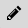
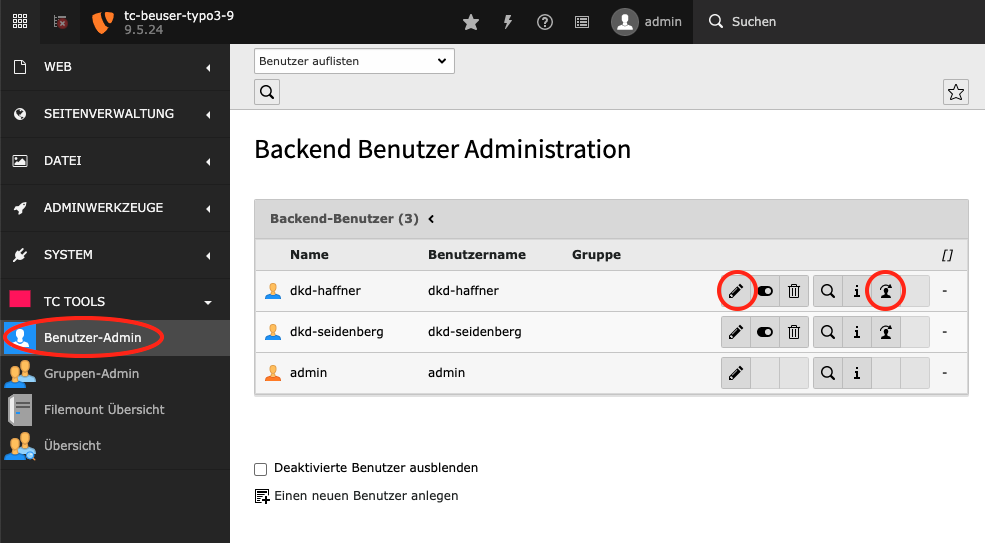
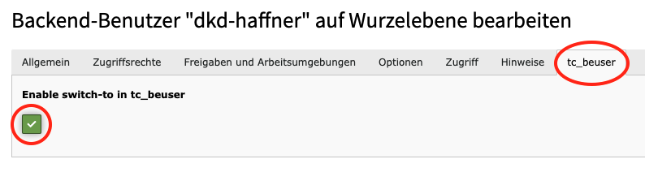
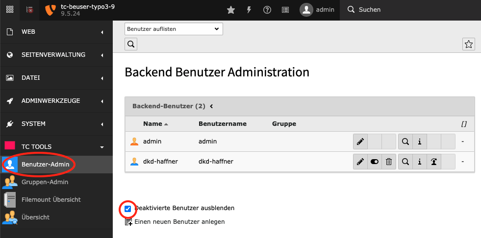
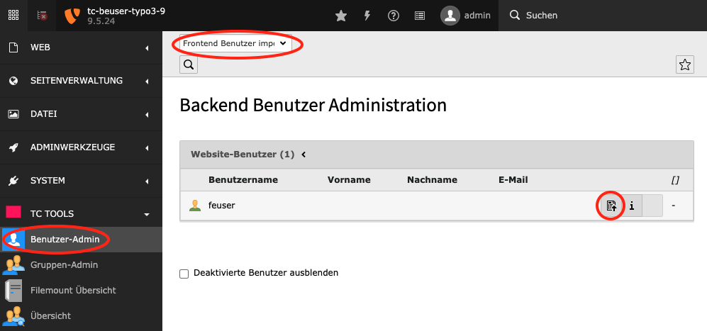
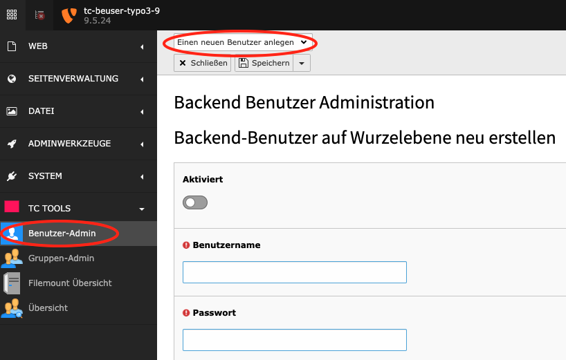
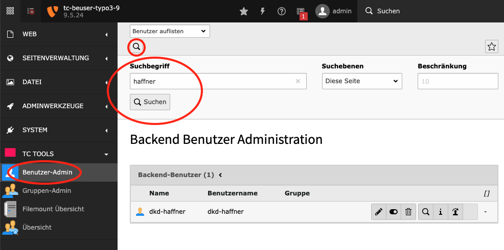

.. ==================================================
.. FOR YOUR INFORMATION
.. --------------------------------------------------
.. -*- coding: utf-8 -*- with BOM.

.. include:: ../Includes.txt

.. _user-admin:

Modul: Benutzer-Admin (User Admin)
==================================

Alphabetische Auflistung der Backend-Benutzer
---------------------------------------------

Mit einem Klick auf die Spaltenüberschrift "Benutzername" erhalten Sie eine aufsteigend sortierte Liste der
Backend-Benutzernamen. Mit einem zweiten Klick auf die Spaltenüberschrift erhalten Sie eine absteigend sortierte Liste
der Backend-Benutzernamen.

Benuter bearbeiten

.. rst-class::  clear-both

Switch-User (switch to mode)

.. rst-class::  clear-both

.. rst-class::  clear-both

Um den Switch-To-Button freizugeben, muss die Checkbox "Enable switch-to in tc_beuser" bei dem Benutzer aktiviert sein.

Filterung deaktivierter Backend-Benutzer
----------------------------------------

Deaktivierte Backend-Benutzer können aus der Liste der herausgefiltert werden um so die Übersichtlichkeit der zu
erhöhen.

Frontend Benutzer importieren
-----------------------------

Wählen Sie oben in der Auswahlbox "Frontend Benutzer importieren". Sie bekommen eine Liste aller Frontend
Benutzer angezeigt.

Durch Klicken auf das Symbol "Diesen Datensatz importieren" bei einem Benutzer, erscheint das ausgefüllte Formular
zum Anlegen eines neuen Benutzers. Durch das Klicken von "Speichern und Schließen" wird der Frontend Benutzer als
Backend Benutzer importiert.

Neuen Benutzer anlegen
----------------------

Wählen Sie oben in der Auswahlbox "Einen neuen Benutzer anlegen". Es wird ein Formular angezeigt, mit dem Sie einen
neuen Benutzer anlegen können.

Suche nach Backend-User
-----------------------

Klicken Sie oben auf das Lupe-Icon. Es ermöglicht die Suche nach Benutzern durch Eingabe eines Suchworts (z.B. Namen).

